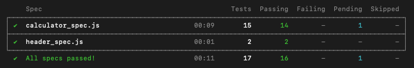

# Cowculator 

## Table of Contents
* [Description](#description)
* [Installation](#installation)
* [Cypress Testing](#cypress)
* [Contributor](#contributor) 

## Description
- Built in React.js (without the use of its built in function `eval()`)
- Application will take text (click calculator display to start typing) or string inputs (calculator buttons)
- Only 2 operators in series - the calculator will need to be cleared or canceled to continue 
- Supports parentheses
- Future features: ability to toggle the positive and negative button and add a more streamlined user experience to go from one problem to the next without having to clear the display
-  [Click here](https://vidmob-cowculator.herokuapp.com/) to deploy the application
 
                                                                              
                                                                                           
                                                                                           

## Installation
1. Clone down this [repo](https://github.com/daomeow/cowculator)
2. `cd` into project directory
3. Run `npm i` to install all project dependencies
4. Run `npm run dev` to begin the server
5. Application should open in default browser window (if not, navigate to http://localhost:3000)

## Cypress Testing 
- Run and view all tests in terminal with `npx cypress run`
- Open Cypress window with `npx cypress open`

## Contributors
<table>
    <tr>
        <td><a href="https://github.com/daomeow">Melanie Daoheuang</td>
    </tr>
    <tr>
      <td></td>
</table>
